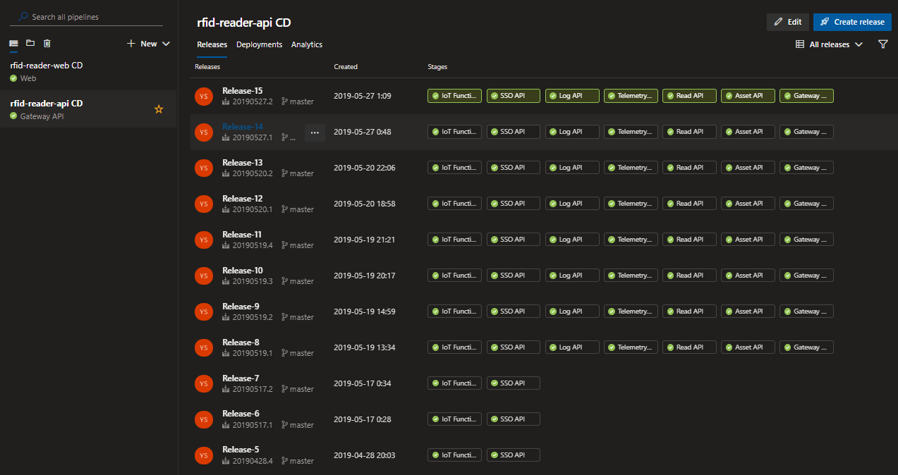

# Service Architecture for Reading RFID tags 

Service architecture for reading RFID tags, implemented in the year 2019 for Master's Work.

## Project architecture

This repository provides the implementation of microservices and API Gateway. For implementation the front-end application, see the application [repository](https://github.com/yagoluiz/rfid-reader-web).

## Master's work

See the work [repository](https://github.com/yagoluiz/unb-dissertacao) for more details of the project.

## Technologies/patterns

- ASP NET Core 2.2
- Azure Functions
- Event Bus (Service Bus)
- API Gateway (Ocelot)
- Identity Server 4
- Docker
- Health Checks
- Mediator
- Feature Folder
- DevOps (CI/CD)

## Azure

Services in Azure implemented in the project:

- App Service
- App Service Plan (Linux)
- Application Insights
- Cosmos DB
- Container Registry
- IoT Hub
- Service Bus
- SQL Database (SQL Server)
- Storage (Blob)

## DevOps

Pipeline CI:

Pipeline CD:

*All resources were deleted after the job was finalized*

## Instructions for run project

- Run project via docker or via Visual Studio or Visual Studio Code

# [PT-BR] Arquitetura de Serviços para Leitura de Tags RFID

Arquitetura de serviços para leitura de tags RFID, implementado no ano de 2019 para trabalho de Mestrado.

## Arquitetura do projeto

Este repositório apresenta a implementação dos microsserviços e API Gateway. Para implementação da aplicação front-end, consulte o [repositório](https://github.com/yagoluiz/rfid-reader-web) da aplicação.

## Trabalho de Mestrado

Consulte o [repositório](https://github.com/yagoluiz/unb-dissertacao) do trabalho para mais detalhes do projeto.

## Tecnologias/padrões utilizados

- ASP NET Core 2.2
- Azure Functions
- Mensageria (Service Bus)
- API Gateway (Ocelot)
- Identity Server 4
- Docker
- Health Checks
- Mediator
- Feature Folder
- DevOps (CI/CD)

## Azure

Serviços no Azure implementados no projeto:

- App Service
- App Service Plan (Linux)
- Application Insights
- Cosmos DB
- Container Registry
- IoT Hub
- Service Bus
- SQL Database (SQL Server)
- Storage (Blob)

## DevOps

Pipeline de CI:

Pipeline de CD:

*Todos os recursos foram excluídos após finalização do trabalho*

## Instruções para execução do projeto

- Executar projeto via docker ou via Visual Studio ou Visual Studio Code